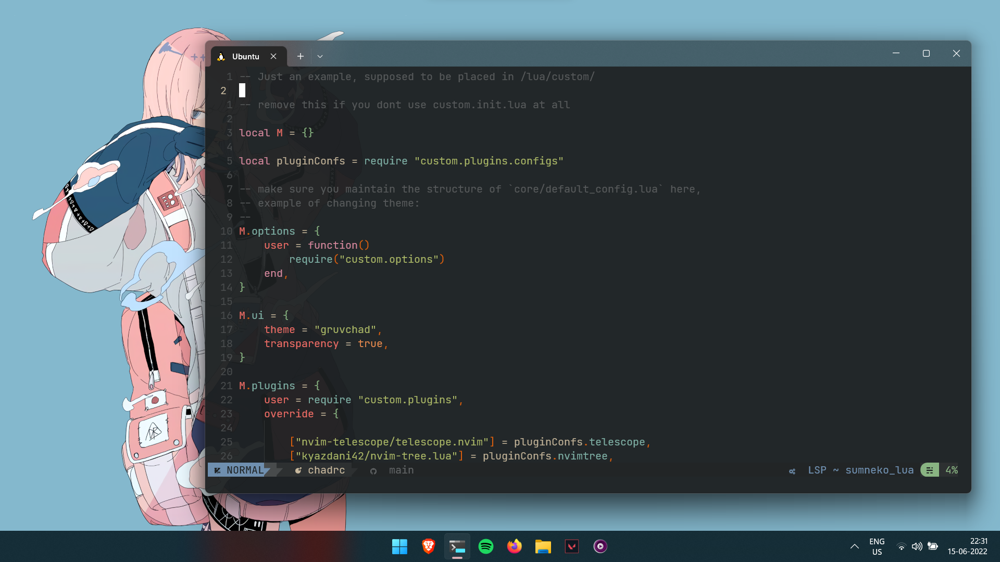
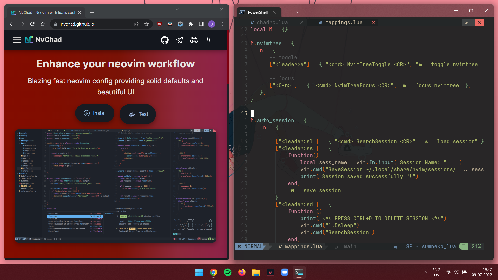
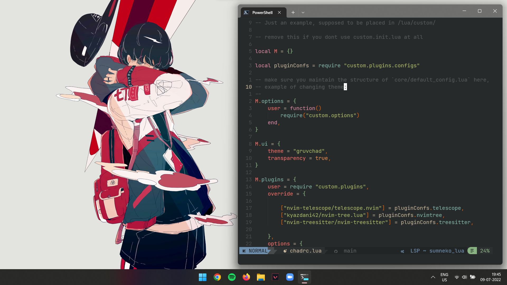
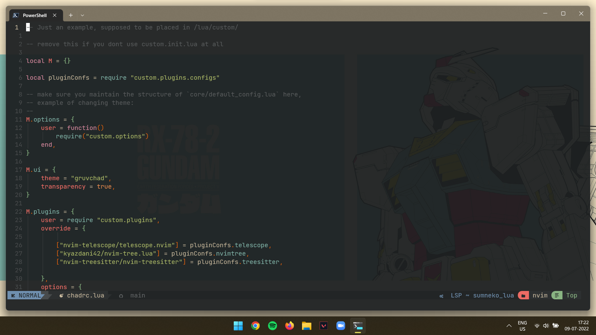

<h2>My highly customized Windows 11 setup</h2>

The setup contains the following components

1. Microsoft PowerToys configs
2. Windows Terminal settings file
3. AutoHotKey Script
4. [Icon Pack](https://www.deviantart.com/jepricreations/art/Windows-11-Cursors-Concept-v2-886489356) and Font
5. Powershell config

Lo and behold, a minimal and blazing fast workflow

<h4>Some extra stuff</h4>

- [Link](https://gitlab.com/sujaybokil7/anime-walls) to my wallpapers
- [Link](https://github.com/sujaybokil/NvChad) to my Neovim ([NvChad](https://github.com/NvChad/NvChad)) config

 

